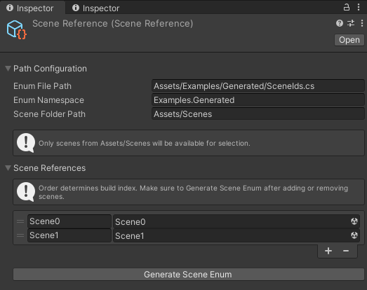

# Unity Scene Reference

Type-safe scene management for Unity with automatic build settings management and scene enum generation.

## Features

- 🎯 **Type-safe Scene Management**: Use enums instead of strings or indexes.
- 🔄 **Auto-sync Build Settings**: Keep your build settings updated automatically.
- 📁 **Scene Filtering**: Show only scenes from your specified folder.
- ✨ **Auto-population**: Populate enums from existing build settings.
- ⚙️ **Configurable**: Customize enum path, namespace, and scene folder.

## Installation

### Option 1: Install via Git URL
`https://github.com/Taiga74164/Unity-SceneReference.git?path=/Assets/Taiga74164`

### Option 2: Install via Manifest file
`"taiga74164.scene-reference": "https://github.com/Taiga74164/Unity-SceneReference.git?path=/Assets/Taiga74164"`

## Quick Start

1. Create your Scene Reference asset:
   - Right click in Project window
   - Select `Create > Taiga74164 > Scene Reference`

2. Configure the Scene Reference:
   - Scene Enum Path: Where the enum will be generated
   - Scene Namespace: Namespace for the generated enum
   - Scene Folder Path: Where your scenes are located

3. Add your scenes:
   - They will be automatically picked up if they're in your build settings
   - Or manually add them using the custom scene picker
   - Click "Generate Scene Enum" to create the enum file
   


4. Use in your code:
```csharp
using UnityEngine;
using UnityEngine.SceneManagement;
using YourNamespace.Generated;

SceneManager.LoadScene((int)SceneId.Level01);
```
